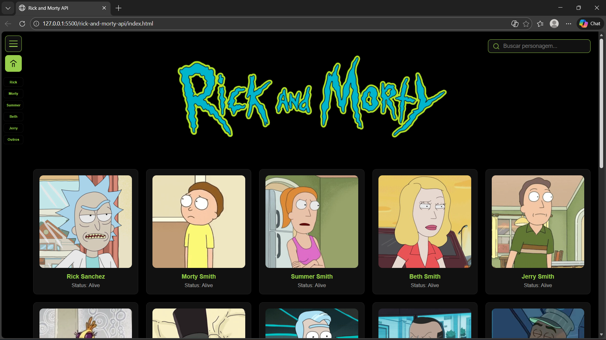

# 🛸 Rick and Morty Characters Explorer

Aplicação web desenvolvida com **HTML, CSS e JavaScript puro**, com o objetivo de consumir  
e explorar a **API pública de Rick and Morty**, exibindo personagens de forma dinâmica, organizada e interativa.

O projeto foi desenvolvido com foco em **boas práticas de front-end**, manipulação do DOM, consumo de API via `fetch` e experiência do usuário.

---

### 👨‍💻 Autor

LUÍS FILIPE DE BRITO COSTA  
Curso: Engenharia da Computação

Projeto desenvolvido de forma autoral para fins acadêmicos!

---

## 📸 Preview — Tela Inicial (Home)



---

## 🎯 Objetivo do Projeto

Este projeto tem como finalidade aplicar, na prática:

- Consumo de APIs REST com JavaScript
- Criação dinâmica de elementos no DOM
- Organização de dados recebidos da API
- Implementação de filtros, busca e paginação
- Construção de uma interface funcional sem uso de frameworks

---

## 🚀 Funcionalidades

✔️ **Listagem dinâmica de personagens**  
Todos os personagens são carregados diretamente da API e renderizados via JavaScript.

✔️ **Cards interativos**  
Cada card exibe:

- Nome do personagem
- Imagem
- Status (vivo, morto ou desconhecido)

✔️ **Paginação**  
Exibição controlada de personagens por página para melhor performance e usabilidade.

✔️ **Busca por nome**  
Campo de pesquisa que filtra personagens em tempo real.

✔️ **Agrupamento inteligente (Sidebar)**  
Personagens organizados em grupos principais:

- Rick
- Morty
- Summer
- Beth
- Jerry
- Outros

✔️ **Sidebar com Accordion**  
Navegação lateral interativa para filtrar personagens por grupo.

✔️ **Modal de detalhes**  
Ao clicar em um personagem, um modal exibe informações adicionais:

- Espécie
- Gênero
- Origem
- Localização atual

✔️ **Layout temático e responsivo**  
Interface inspirada no universo de Rick and Morty, com cores, ícones e organização visual coerentes.

---

## 🧪 Tecnologias Utilizadas

- **HTML5**
- **CSS3**
- **JavaScript (ES6+)**
- **Rick and Morty Public API**

---

## 🧠 Decisões Técnicas

- **JavaScript puro (Vanilla JS)** para reforçar o domínio da linguagem.
- Uso de **fetch API** para consumo dos dados.
- Manipulação direta do DOM para criação dos cards e sidebar.
- Separação clara entre:
  - Estrutura (HTML)
  - Estilo (CSS)
  - Lógica (JavaScript)
- Código organizado e legível, facilitando manutenção e evolução.

---

## 🌐 API Utilizada

Rick and Morty API  
🔗 https://rickandmortyapi.com/

---

## ▶️ Como Executar o Projeto

### Opção 1 — Navegador

1. Clone o repositório:

```bash
git clone https://github.com/seu-usuario/nome-do-repositorio.git
```

2. Acesse a pasta

```bash
cd nome-do-repositorio
```

3. Abra o arquivo **index.html** no navegador.

### Opção 2 — Live Server (Necessário Instalar Extensão)

1. Abra o projeto no VS Code

2. Clique com o botão direito no **index.html**

3. Selecione `Open with Live Server`

---

## 📚 Observações Finais

Este projeto foi desenvolvido com fins acadêmicos, porém seguindo padrões próximos a aplicações reais, visando clareza, organização e boa experiência do usuário.

---

## 📄 Direitos Autorais

© 2026 Luís Filipe de Brito Costa

Este projeto é de autoria própria!  
A reprodução total ou parcial sem autorização não é permitida!
